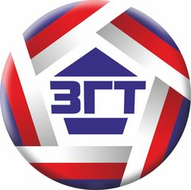

# HomeProject-TBD

Тестовое задание для "Завода готовых теплиц"

 

Приложение для работы c пользователями, представляет из себя приложение с несколькими экранами. Приложение работает через авторизацию -aouth и позволяет получить доступ к чатам.

## О проекте:

 § Функционал проекта поддерживает:

 * Регистрация пользователя.
 * Авторизация.
 * Чаты со специалистами.
 * Редактирование профиля.

 § Архитектура проекта: 

 * MVC 
 
 § Используемая система контроля версий: 

 * Trunk Based Development

 § Структура проекта:

    1. Авторизация.
    1.1. Номер телефона.
    1.2. Код подтверждения СМС.
    2. Регистрация.
    3. Чаты. (Только верстка самого простого чата, без функционала) 
    3.1. Чат. (Только верстка самого простого чата, без функционала)
    4. Профиль.
    4.1. Редактирование профиля.

              
## Требования

* iOS 16.x
* Xcode 14.x
* Swift 5.x
              
## Установка

* Установить на Iphone.
* Вход в приложение авторизацию.
